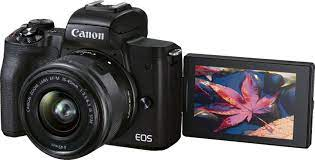

# @aaronshunter Teleprompter Setup

Hey there! Welcome to my guide on how I set up my teleprompter 😁 

If you’re here, you probably heard me talking about my teleprompter and how I use it to join meetings, teach AWS Training and Certification (T&C) courses, or [deliver a show on Twitch](https://awspowerhour.com/). Using a teleprompter is a great way to maintain eye contact with the camera without losing focus on your subject or content. Huge thanks to my friend Jon Dion because, without him, I’d still be awkwardly staring off to the side of the camera. But first, a disclaimer!

Let’s break this article down into a few categories:

* GEAR/EQUIPMENT
* TRAININGS
* MEETINGS

📝**NOTE**: *The Amazon links below are affiliate links and clicking them will help me without any additional cost to you! Thanks for your support*

* * *

## GEAR/EQUIPMENT  
First, the gear. There are a few pieces of equipment I’ve found that helped me get set up for my personal preference. Your mileage may vary, so find what works best for you. My setup includes the **Glide Gear TMP100 teleprompter** ([Amazon link](https://www.amazon.com/dp/B019AJOLEM?_encoding=UTF8&tag=aaronshunter-20)). This is a really nice teleprompter for what I need it to do. It has a fully adjustable bracket that slides in and out, the glass tilts to different viewing angles, and there’s a fabric hood in the back to help prevent light from shining through the glass. Nice, so nice. Note: The TMP100 images show a DSLR (really big camera) is attached, but I personally use my **Logitech C920** (oldie but a goodie) without any issues. 

**TELEPROMPTER/MONITOR**  
The teleprompter is marketed for an iPad/Tablet/Smartphone, but you can use it with a monitor as well. Using an iPad as a monitor doesn’t work me so I looked around for a monitor that I could use. I ordered 7, yes SEVEN, different monitors until I found one that fits the TMP100 bracket spacing. I settled with the **WIMAXIT 10.1 inch Monitor** ([Amazon link](https://www.amazon.com/dp/B074JWQ57Y/ref=nosim?tag=aaronshunter-20))**. **While this monitor has a 1920x1080 resolution, which is more than enough for my needs, there is one major drawback that doesn’t work as a functional teleprompter display... YOU CAN’T ROTATE THE DISPLAY! So, I use OBS to flip my display. Maybe one day I’ll find a monitor that fits and has that functionality, but for now this works good enough :)

**DESK MOUNT**  
Ok, so now that we have our teleprompter and monitor - we need a way to attach it to our desk. I mean... it doesn’t just float (but how awesome would that be?!). For this, I use the **VIVO Single Monitor Arm** ([Amazon link](https://www.amazon.com/dp/B00B21TLQU/ref=nosim?tag=aaronshunter-20)) which I found the teleprompter fits perfectly onto one of the bolts on the arm. I can loosen a single bolt to adjust the arm up and down, then tighten the bolt again. once it’s in the correct height, I can swivel the arm to the exact position I need. It’s inexpensive, simple to install and adjust, and works just fine!

**LIGHTING**  
~**May 2022** I’ve added a ring light to my collection of gear. I ordered and tested a few ring lights and found the **Lume Cube 18 Inch Cordless Ring Light** ([Amazon Link](https://www.amazon.com/gp/product/B08WWGRN2Y/ref=nosim?tag=aaronshunter-20)) is the better option in my opinion. The 18 inch model fits perfectly over the teleprompter and casts a beautiful light. Something I’ve found The benefit of using a ring light is an even and flattering light on the face, and helps to reduce light that’s reflected from eyeglasses (in my experience).~

**Oct 2022** I’ve replaced the ring light with two **Elgato Key Lights** ([Amazon Link](https://www.amazon.com//dp/B07L755X9G/ref=nosim?tag=aaronshunter-20)) because I wear glasses and the ring light caused a reflection. The Elgato Key Lights can be positioned offset from the camera, which helps significantly. That's exactly how I have them, one on my right (at about 3% brightness) and one on my left (at about 10% brightness). Notice how "dim" I have them set... they're good, but BRIGHT. 

**APR 2023** Several people have asked me about my camera setup, which is great timing because it's changed since first publishing this article when I was using the Logitech C920. I still use the webcam, but not as part of my teleprompter setup 😄. I upgraded to the Canon EOS M50 Mark II camera, which is night and day to the Logitech C920. One thing I learned about this camera is the USB cable is not good enough. Don't get me wrong, it's better than most USB webcams but... it can be better. To level-up the quality, get a capture card! I've added the Elgato Cam Link 4K capture card which allows me to record and live stream at the highest quality. 

Here are some (affiliate) links and photos of each component:  
**Glide Gear TMP100 teleprompter**  
<a href="https://www.amazon.com/dp/B019AJOLEM/ref=nosim?tag=aaronshunter-20">
Amazon link 

</a>

**WIMAXIT 10.1 inch Monitor**  
<a href="https://www.amazon.com/dp/B074JWQ57Y/ref=nosim?tag=aaronshunter-20">
Amazon link 

</a>

**VIVO Single Monitor Arm**  
<a href="https://www.amazon.com/dp/B00B21TLQU/ref=nosim?tag=aaronshunter-20">
Amazon link 

</a>

**Elgato Key Light**  
<a href="https://www.amazon.com/dp/B07L755X9G/ref=nosim?tag=aaronshunter-20">
Amazon link 

</a>

**CAMERA**  
Canon M50 Mark II w/ kit (15-45mm) lens  
[Amazon link](https://www.amazon.com/dp/B08KSKV35C/ref=nosim?tag=aaronshunter-20)  

**CAPTURE CARD**  
Elgato Cam Link 4K, External Camera Capture Card  
[Amazon link](https://www.amazon.com/dp/B07K3FN5MR/ref=nosim?tag=aaronshunter-20)  
  

* * *
## ADDITIONAL (AUDIO) EQUIPMENT  
With the majority of the equipment covered, I wanted to share some additional equipment I use that others have asked me about. My microphone is built using a wireless mic system (DJI) and an earhook mic - keep in mind this mic combo will require a TRS to TRRS adapter (linked below). Getting the microphone capsule closer to your mouth is helpful to improve audio quality (most times) and the earhook mic does a good job accomplishing this. In addition to the mic, I use Bose QuietComfort over the ear headphones. They really are comfortable, and great for travel too. Here's a list, with links, for each. 

If I'm not using my Bose QC45 headphones and earhook mic, you can find me using my PowerDeWise Lav Mic clipped to my shirt. The lav mic gets plugged into my DJI wireless mic (without the need of an adapter). I'm pretty pleased with the sound quality of the lav mic and there doesn't seem to be any audio interference. It's a keeper and I've added it to my kit!

**WIRELESS MIC**  
DJI Mic (2 TX + 1 RX + Charging Case), Wireless Lavalier Microphone  
<a href="https://www.amazon.com/dp/B09GYD55JF/ref=nosim?tag=aaronshunter-20">
Amazon link  
  
</a>

**EARHOOK MIC**  
Av-Jefes AVL630B35LS Black Color Mini Headset Mic for Sennheiser Wireless Microphone  
<a href="https://www.amazon.com/dp/B07H8TKF62/ref=nosim?tag=aaronshunter-20">
Amazon link   
  
</a>

**3.5mm TRS to TRRS ADAPTER**  
Riqiorod 3.5mm TRS to TRRS Adater
<a href="https://www.amazon.com/dp/B07HF39FXQ/ref=nosim?tag=aaronshunter-20">
Amazon link  
  
</a>

**LAV MIC**  
PowerDeWise Lav Mic  
<a href="https://www.amazon.com/dp/B01AG56HYQ/ref=nosim?tag=aaronshunter-20">
Amazon link  

</a>

**HEADPHONES**  
Bose QuietComfort 45 Bluetooth Wireless Noise Cancelling Headphones - Triple Black  
<a href="https://www.amazon.com/dp/B098FKXT8L/ref=nosim?tag=aaronshunter-20">
Amazon link  
  
</a>

* * *

## TRAININGS

Cool. I just ~~spent~~ invested a lot of money (🔥💸🔥)... cool cool cool. Now what? Use it for the fun stuff! 

I use the teleprompter for my digital content and presentations. I’ve also used it to perform live training (live streams) on Twitch! Check out awspowerhour.com to see those episodes and what's coming up next. The teleprompter is nice but, due to monitor limitations, I use OBS Studio to flip the display and project to the teleprompter. In my case, the teleprompter is mounted directly above my laptop, so I use either the laptop display or my drawing tablet. There are so many ways you could do this, so do what’s best for you --- this is just what works best for me... for now (as you can see from the updates/changes above 😁)

**OBS Studio Preview window**
Create a new scene
Give the scene a name
Connect a source (LaptopDisplayCapture in my case for example)
Edit the display through OBS to flip/mirror horizontally (right click on the display, transform, flip horizontal)

**OBS Program window**
Right click 
Full screen to projector
Select your teleprompter monitor

Now I use my laptop as the primary monitor that is mirrored and displayed on the teleprompter monitor!

Here’s a picture of the monitor with an introduction training module (Advanced Architecting on AWS in the house... w00t w00t):

* * *

## MEETINGS

I do the same thing for meetings too! I use this for meetings which helps so so so much. Now I can focus on people in the meeting who have their webcam enabled without looking off to the side and it allows me to maintain eye contact with the camera. 

Here’s a picture of me using this setup during a meeting. I’ve added a second photo that’s zoomed in where you can (barely) see two blue “parenthesis” looking things... that’s my **Logitech C920** camera! *I know... I know... I’m not looking at the camera. Shame!* PROOF you don’t need a big DSLR camera. In fact, I prefer having the blue lines so /1 I know the camera is on (it's the little things in life) and /2 I know I’m looking at the camera since the camera isn’t easily seen through the mirror. ** 

| | |
|---|---|

* * *

## Conclusion

In the end, the teleprompter is one of the best enhancements to my desk setup and I wish I added it years ago. Virtual engagements will **never** be the same. Totally worth the money, time, and energy. 

Alright everyone. I hope you found this helpful. Take care!  

👋 Aaron 

#########################################

Connect with me on LinkedIn  
https://www.linkedin.com/in/aaronshunter/

#########################################

Follow me on Twitter @aaronshunter  
https://twitter.com/aaronshunter

#########################################
